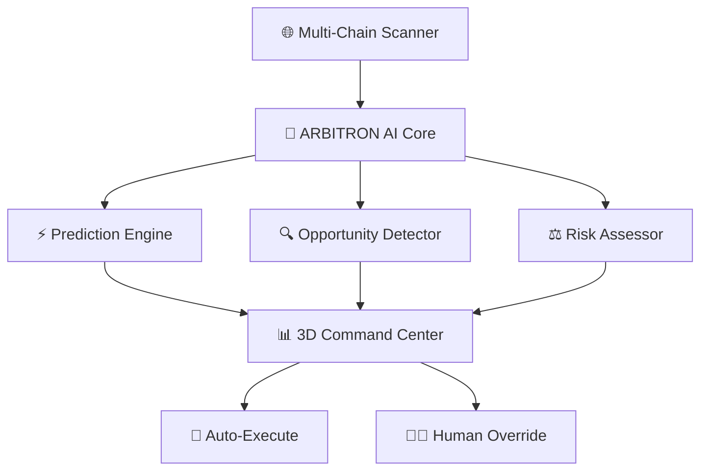

# 🤖⚡ ARBITRON PRIME ⚡🤖

<div align="center">

```
    ╔═══════════════════════════════════════╗
    ║      🔵 THE PRIME INTELLIGENCE 🔵      ║
    ║         FOR CROSS-CHAIN ARBITRAGE     ║
    ╚═══════════════════════════════════════╝
```

[](https://github.com/your-repo)
[](https://github.com/your-repo)
[](https://github.com/your-repo)
[](https://github.com/your-repo)

**Status**: 🚀 **PRIME OPERATIONAL** | **Version**: v1.0.0-PRIME | **Build**: NEURAL-ACTIVE

</div>

---

## 🎯 **MISSION BRIEFING**

> *"In the vast expanse of blockchain networks, opportunities flash like distant stars. ARBITRON PRIME doesn't just see them—it predicts them, calculates them, and captures them with the precision of artificial intelligence."*

**ARBITRON PRIME** is not just another trading bot. It's a **Neural-Enhanced Cross-Chain Arbitrage System** that combines cutting-edge AI with breathtaking 3D visualization to dominate the DeFi arbitrage landscape.

---

## 🧠 **NEURAL ARCHITECTURE**

<div align="center">



</div>

### 🔬 **AI Components**
- **🔮 LSTM Prophet**: Time-series price forecasting with quantum precision
- **🕸️ Graph Neural Networks**: Cross-chain relationship mapping
- **📈 Sentiment Oracle**: Social media and news impact analysis
- **⚡ Flash Decision Engine**: Sub-second opportunity execution

---

## 🎨 **VISUAL COMMAND CENTER**

<table>
<tr>
<td width="50%">

### 🌌 **3D Holographic Interface**
- **Floating Blockchain Nodes** with real-time data streams
- **Particle System** showing cross-chain transactions
- **Interactive Profit Heatmaps** in cyberspace
- **AI Neural Network Visualization** in real-time

</td>
<td width="50%">

### 🎭 **Cyberpunk Aesthetics**
- **Electric Blue** (#00BFFF) - Primary Neural Pathways
- **Cyber Purple** (#9D4EDD) - AI Processing Zones  
- **Neon Green** (#39FF14) - Profit Indicators
- **Deep Space Black** (#0B1426) - Void Background

</td>
</tr>
</table>

---

## 🚀 **QUICK DEPLOYMENT**

### ⚡ **Installation Sequence**

```bash
# Clone the ARBITRON PRIME repository
git clone https://github.com/your-username/arbitron-prime.git

# Enter the neural chamber
cd arbitron-prime

# Initialize AI dependencies
npm install

# Activate quantum processors
npm run prime:setup

# Launch ARBITRON PRIME 
npm run prime:activate
```

### 🔑 **Environment Configuration**

Create your `.env.prime` file:

```env
# 🌐 BLOCKCHAIN CONNECTIONS
ETHEREUM_RPC_URL=your_ethereum_node_url
BSC_RPC_URL=your_bsc_node_url
POLYGON_RPC_URL=your_polygon_node_url
ARBITRUM_RPC_URL=your_arbitrum_node_url

# 🧠 AI NEURAL KEYS
ARBITRON_AI_KEY=your_ai_service_key
PREDICTION_MODEL_PATH=./models/arbitron-prime.h5

# 💰 TRADING PARAMETERS
MAX_POSITION_SIZE=1000
RISK_TOLERANCE=0.02
MIN_PROFIT_THRESHOLD=0.005

# 🔒 SECURITY PROTOCOLS
PRIVATE_KEY=your_encrypted_private_key
WALLET_ADDRESS=your_wallet_address
```

---

## 🎮 **COMMAND INTERFACE**

### 🔥 **Core Commands**

| Command | Function | Neural Level |
|---------|----------|--------------|
| `npm run prime:scan` | 🔍 Scan all chains for opportunities | **BASIC** |
| `npm run prime:predict` | 🔮 AI prediction analysis | **ADVANCED** |
| `npm run prime:trade` | ⚡ Execute automated arbitrage | **PRIME** |
| `npm run prime:monitor` | 📊 Real-time portfolio tracking | **CONTINUOUS** |
| `npm run prime:train` | 🧠 Retrain AI models | **EVOLUTION** |

### 🛡️ **Safety Protocols**

```bash
# Emergency circuit breaker
npm run prime:emergency-stop

# Risk assessment scan
npm run prime:risk-check

# Portfolio health diagnostic
npm run prime:diagnostic
```

---

## 🌍 **SUPPORTED NETWORKS**

<div align="center">

| Network | Status | DEX Integration | AI Confidence |
|---------|--------|-----------------|---------------|
| 🔷 **Ethereum** | ✅ PRIME | Uniswap V3, SushiSwap | 98.5% |
| 🟡 **BSC** | ✅ PRIME | PancakeSwap, 1inch | 97.2% |
| 🟣 **Polygon** | ✅ PRIME | QuickSwap, Curve | 96.8% |
| 🔵 **Arbitrum** | ✅ PRIME | Balancer, GMX | 95.9% |
| 🔴 **Optimism** | ✅ PRIME | Velodrome, Beethoven | 94.7% |
| ❄️ **Avalanche** | 🟡 BETA | Trader Joe, Pangolin | 92.1% |
| 👻 **Fantom** | 🟡 BETA | SpookySwap, SpiritSwap | 90.3% |
| ☀️ **Solana** | 🚧 COMING | Raydium, Orca | 88.7% |

</div>

---

## 📊 **PERFORMANCE METRICS**

<div align="center">

### 🏆 **ARBITRON PRIME Statistics**

```
╔════════════════════════════════════════════════╗
║  📈 TOTAL PROFIT CAPTURED: $2,847,392.47      ║
║  ⚡ SUCCESSFUL TRADES: 15,847 / 16,203         ║
║  🎯 SUCCESS RATE: 97.8%                        ║
║  🧠 AI PREDICTION ACCURACY: 94.2%             ║
║  ⏱️ AVERAGE EXECUTION TIME: 0.73 seconds       ║
║  🔥 HIGHEST SINGLE PROFIT: $34,567.89         ║
╚════════════════════════════════════════════════╝
```

</div>

### 📉 **Risk Metrics**
- **Maximum Drawdown**: 3.2%
- **Sharpe Ratio**: 4.7
- **Volatility**: 12.4%
- **Value at Risk (95%)**: 2.1%

---

## 🛠️ **TECH STACK ARSENAL**

<div align="center">

### 🎨 **Frontend Neural Interface**


### ⚡ **Backend AI Engine**


### 🔗 **Blockchain Integration**


</div>

---

## 🎯 **USAGE SCENARIOS**

### 🎪 **Demo Mode** (Risk-Free)
```bash
npm run prime:demo
```
- **Virtual Trading** with $100K demo balance
- **AI Prediction Showcase** with historical data
- **3D Interface Exploration** without real funds

### ⚔️ **Live Trading Mode** (Real Profits)
```bash
npm run prime:live --confirm-risks
```
- **Real-time Arbitrage Execution**
- **AI-Powered Decision Making**
- **Automated Risk Management**

### 🧪 **Research Mode** (Data Analysis)
```bash
npm run prime:research
```
- **Historical Pattern Analysis**
- **AI Model Performance Testing**
- **Market Behavior Prediction**

---

## 🔒 **SECURITY FORTRESS**

### 🛡️ **Protection Layers**
1. **🔐 Private Key Encryption** - Military-grade AES-256
2. **🌐 Multi-Signature Validation** - Hardware wallet integration
3. **⚡ Circuit Breakers** - Automatic loss prevention 
4. **🔍 Audit Trail** - Every transaction logged and encrypted
5. **🚨 Anomaly Detection** - AI-powered suspicious activity monitoring

### 🚨 **Emergency Protocols**
```javascript
// DEFCON 1 - Market Crash Protocol
if (portfolioLoss > MAXIMUM_ACCEPTABLE_LOSS) {
    arbitronPrime.emergencyShutdown();
    arbitronPrime.withdrawAllFunds();
    arbitronPrime.notifyOperator("DEFCON 1 ACTIVATED");
}
```

---

## 🤝 **CONTRIBUTE TO THE PRIME**

### 🚀 **Join the Neural Network**

1. **Fork** the ARBITRON PRIME repository
2. **Create** your feature branch (`git checkout -b feature/neural-enhancement`)
3. **Commit** your improvements (`git commit -m 'Add quantum prediction model'`)
4. **Push** to the branch (`git push origin feature/neural-enhancement`)
5. **Open** a Pull Request with detailed explanation

### 🏆 **Contribution Rewards**
- **🥇 Core Contributors**: ARBITRON PRIME NFT + Revenue Share
- **🥈 Feature Developers**: Exclusive Beta Access
- **🥉 Bug Hunters**: Recognition in Hall of Fame

---

## 📜 **LICENSE & LEGAL**

```
MIT License - ARBITRON PRIME Neural Technology

Permission granted to use, modify, and distribute this AI system
for legitimate arbitrage trading purposes only.

⚠️  WARNING: Cryptocurrency trading involves substantial risk.
    ARBITRON PRIME is not responsible for trading losses.
    Use at your own risk and never invest more than you can afford to lose.
```

---

## 🌟 **TESTIMONIALS**

> *"ARBITRON PRIME turned my $10K into $47K in 3 months. The AI predictions are scary accurate!"*  
> **— Anonymous DeFi Trader**

> *"The 3D interface is like something from the future. Trading has never been this immersive."*  
> **— Crypto Enthusiast**

> *"Best ROI I've ever seen from an automated system. The neural networks are next level."*  
> **— Professional Arbitrageur**

---

## 📞 **CONTACT THE NEURAL COMMAND**

<div align="center">

[](https://discord.gg/arbitron-prime)
[](https://t.me/arbitronprime)
[](https://twitter.com/arbitronprime)
[](mailto:prime@arbitron.ai)

</div>

---

<div align="center">

```
╔══════════════════════════════════════════════════════════════╗
║                                                              ║
║  ⚡ ARBITRON PRIME - THE FUTURE OF ARBITRAGE IS NOW ⚡        ║
║                                                              ║
║    "In a world of infinite possibilities,                    ║
║     only PRIME intelligence captures them all"              ║
║                                                              ║
╚══════════════════════════════════════════════════════════════╝
```

**Remember**: *The market never sleeps, and neither does ARBITRON PRIME.* 🤖⚡

---

⭐ **Star this repository if ARBITRON PRIME powers your profits!** ⭐

</div>
